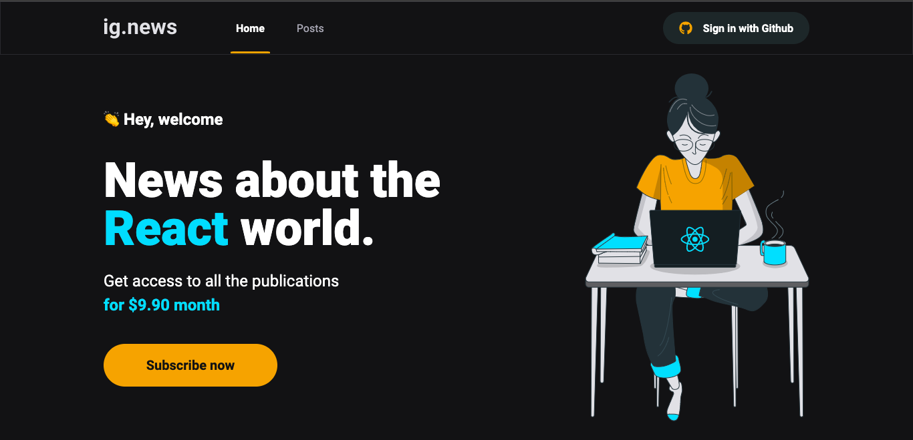
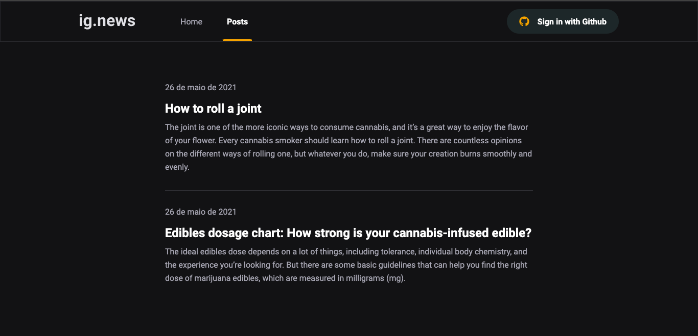

<h1 align="center">react.news</h1>

# 🎥 Overview:

 

# 💻 Project:

The project is basically a blog, with paid signature option that gives you access to all the posts content.    
You can also authenticate with Github (made with nextauth).    
The posts are written using a CMS (Prismic).    
To deal with the paid signature, I used the Stripe API.    
To verify if the user has an active paid signature to give him access to the posts, I used FaunaDB.

 

# ⚡ Technologies:

### • ReactJS

### • Next.js

### • Typescript

### • SASS

### • FaunaDB
