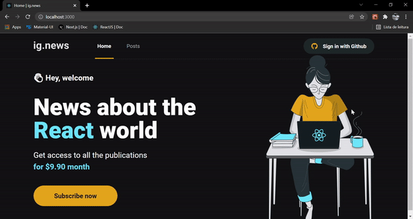

<h1 align="center">ReactNews</h1>

# 🎥 Overview:

 

# 💻 Project:

The project is about ReactJS posts (similar to a blog), with paid signature that gives you access to the full posts content.

- The user can authenticate with Github (NextAuth.js auth strategy);
- Landing page was generated statically (SSG);
- The posts were written using Prismic CMS;
- The Prismic API was used to get the posts content (consumed by server side);
- To handle paid signature and verify the user subscription status (Webhooks), Stripe API was used;
- API Routes / Serverless functions were used to handle API calls to the Stripe API so the user can have a subscription;
- FaunaDB was used to verify if the user has an active subscription to give him access to the full posts content;

When developing the application I improved my knowledge in Server-side rendering, Static site generation and API routes / Serverless functions.

 

# ⚡ Technologies:

### • ReactJS

### • Next.js

### • Typescript

### • SASS

### • FaunaDB
